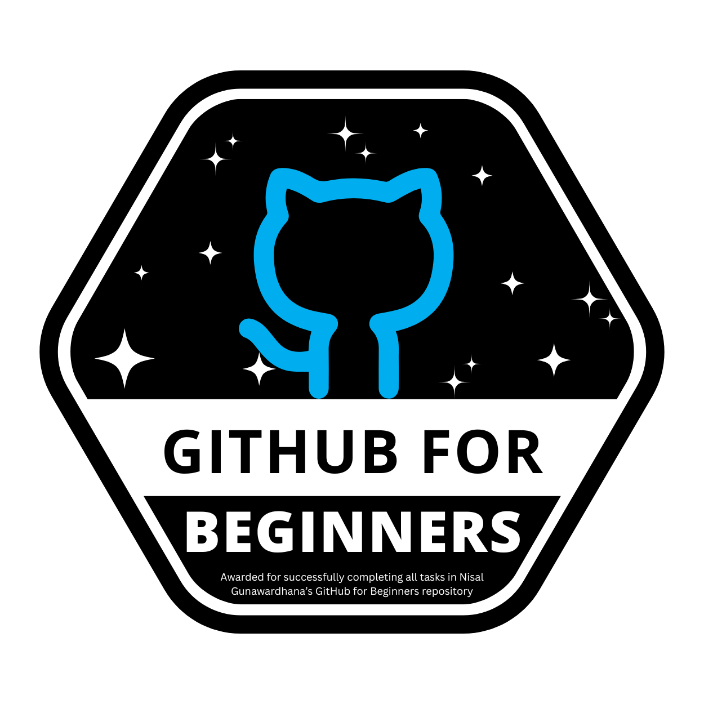

<p align="center">  </p>
<h1 align="center">
  I'm Nimesh Kolambage 
  
</h1>

<p align="center">
  
  
</p>

<p align="center">
  <a href="https://nimeshkolambage.me/"></a>
  <a href="https://www.linkedin.com/in/nimesh-kolambage-595454346/"></a>
  <a href="nimeshkolambage@gmail.com"></a>
  <a href="YOUR_LINK_HERE"></a>
  <a href="YOUR_LINK_HERE"></a>
</p>
## 🏅 Certifications & Badges

<p align="center">
  <table>
    <tr>
      <td align="center">
        <a href="https://badgr.com/public/assertions/RmJiCjEbQt27l9imw53vjg" target="_blank">
          
        </a>
        <br/>
        <b>🤖 AI Literacy</b>
        <br/>
        <sub>IBM SkillsBuild · Mar 2026</sub>
      </td>
      <td align="center">
        
        <br/>
        <b>☁️ API Learning 101</b>
        <br/>
        <sub>Nisal Gunawardhana · 2026</sub>
      </td>
      <td align="center">
        
        <br/>
        <b>🐙 GitHub for Beginners</b>
        <br/>
        <sub>Nisal Gunawardhana · 2026</sub>
      </td>
    </tr>
  </table>
</p>

## 👨‍💻 About Me

```js
const aboutMe = {
  name: "Nimesh Kolamabge",
  role: "Frontend Developer",
  specialization: "UI/UX + Web Apps",

  stack: ["React", "JavaScript", "PHP", "Laravel"],
  database: ["MySQL", "MongoDB"],
  tools: ["Figma", "Git", "Linux"],

  currentlyLearning: "Advanced Frontend & Clean Architecture",
  goal: "Build modern, fast, user-friendly applications",

  status: "Available for projects 🚀"
};
```


## 🧰 Languages & Tools

<p align="center">
  
</p>
<p align="center">
  
</p>
